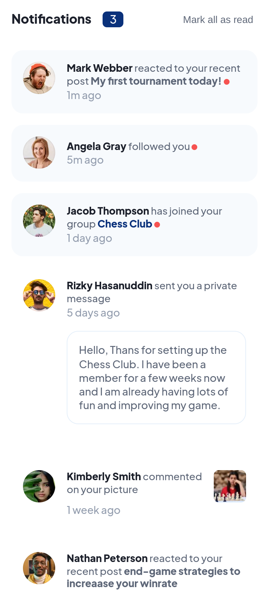
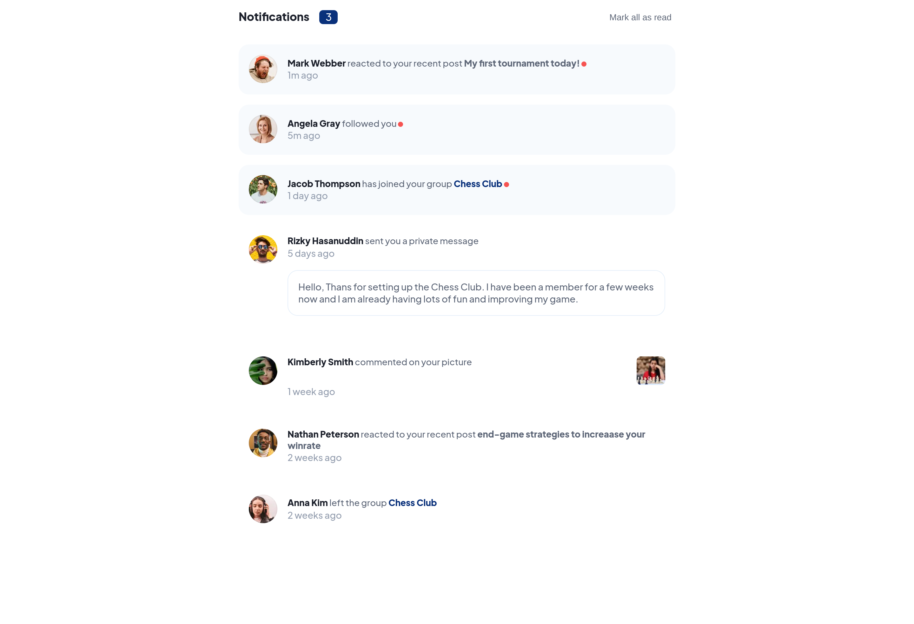

## Table of contents

- [Overview](#overview)
  - [Screenshot](#screenshot)
  - [Links](#links)
- [My process](#my-process)
  - [Built with](#built-with)
  - [What I learned](#what-i-learned)
- [Author](#author)

## Overview

### Screenshot

### Links

- URL: [Site](https://frontendmentor-notifications-react.vercel.app/)

## My process

### Built with

- Semantic HTML5 markup
- CSS custom properties
- Flexbox
- Mobile-first workflow
- React

### What I learned

Through the development of this project I was able to reinforce my knowledge of React.

## Author

- Website - [Anderson Valencia](https://github.com/Andersonvb)
- Frontend Mentor - [@Andersonvb](https://www.frontendmentor.io/profile/Andersonvb)
- Twitter - [@Anderson_v_b](https://www.twitter.com/Anderson_v_b)